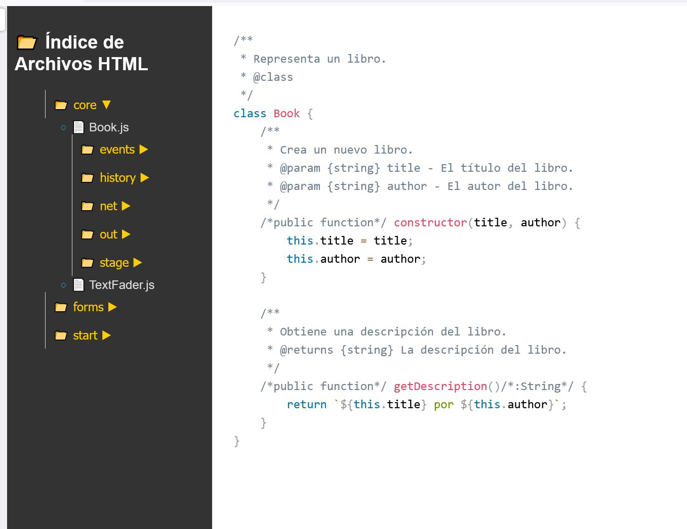

**jsdFileExplorer** is a simple tool similar to jsDoc, created specifically for my needs. I didn't use jsDoc because my programming style includes JavaScript comments to specify types, and jsDoc doesn't always process them correctly. That's why I created something that doesn't need to process the document.

**jsdFileExplorer** scans the specified `.js` files and folders, highlights the code with Prism, and converts them into `.html` files. The highlighted code is saved statically, so [Prism.js](https://Prism.js) is only needed during the document creation. When reading the documents, only `prism.min.css` is needed.

In addition to highlighting the code and converting it to HTML, jsdFileExplorer creates a folder and file structure similar to the original, with an `index.html` that includes a Windows Explorer-style menu to navigate through the project files.

**Requirements:**

* Have [Node.js](https://Node.js) installed.

**Usage:**

1. Download the jsdFileExplorer files next to the folder containing your `.js` files. Let's assume your folder is named `app` and is inside `my_project`.
2. Open `jsdFileExplorer.js` with VSCode and configure the source and destination folders:
   javascript

   ```
   const sourceDir = "app";
   const destinationDir = "jsdoc";
   ```
3. Save the changes, open CMD, and navigate to the `my_project` folder:
   cmd

   ```
   C:\path\to\my_project>
   ```
4. Run jsdFileExplorer:
   cmd

   ```
   C:\path\to\my_project>node jsdFileExplorer.js
   ```
5. A new folder named `jsdoc` will appear with the structure of folders and `.js` files converted to HTML. The files needed to upload to the server are the `jsdoc` folder, `index.html`, and `prism.min.css`.

**Other considerations:**

* In the downloaded package, you'll also find earlier versions that generate `jsdocFileExplorer.bat` using a `.bat` file, but I opted to use [Node.js](https://Node.js) to highlight the code.
* There's also a version `jsdocFileExplorerWithCDN.js` that requires internet access to use the CDNs and highlights the code each time a file is opened.
* If you don't have the `node_modules` folder with the Prism module, run `npm init -y` in the project folder and then `npm install prismjs`. Copy the file `\node_modules\prismjs\themes\prism.min.css` next to `index.html`.
