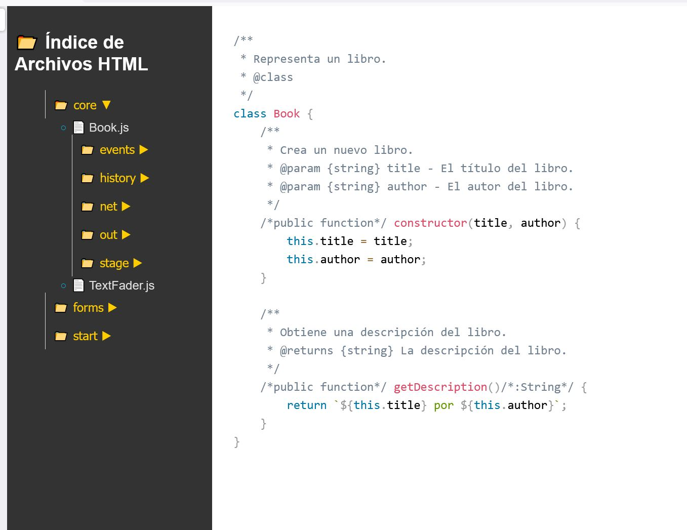

**jsdFileExplorer** es una herramienta sencilla similar a jsDoc, creada específicamente para mis necesidades. No usé jsDoc porque mi estilo de programación incluye comentarios en JavaScript para especificar tipos, y jsDoc no siempre los procesa correctamente. Por eso, creé algo que no necesita procesar el documento.

**jsdFileExplorer** recorre los archivos `.js` y carpetas especificadas, resalta el código con Prism y los convierte en archivos `.html`. El código resaltado se guarda de forma estática, por lo que [Prism.js ](https://Prism.js)solo es necesario durante la creación de los documentos. Al leer los documentos, solo se necesita `prism.min.css`.

Además de resaltar el código y convertirlo en HTML, jsdFileExplorer crea una estructura de carpetas y archivos similar a la original, con un `index.html` que incluye un menú estilo explorador de Windows para navegar por los archivos del proyecto.

**Requisitos:**

* Tener instalado [Node.js.](https://Node.js)

**Uso:**

1. Descarga los archivos de jsdFileExplorer junto a la carpeta que contiene tus archivos `.js`. Supongamos que tu carpeta se llama `app` y está dentro de `my_project`.
2. Abre `jsdFileExplorer.js` con VSCode y configura las carpetas de origen y destino:
   javascript

   ```
   const sourceDir = "app";
   const destinationDir = "jsdoc";
   ```
3. Guarda los cambios, abre CMD y navega a la carpeta `my_project`:
   cmd

   ```
   C:\path\to\my_project>
   ```
4. Ejecuta jsdFileExplorer:
   cmd

   ```
   C:\path\to\my_project>node jsdFileExplorer.js
   ```
5. Aparecerá una nueva carpeta llamada `jsdoc` con la estructura de carpetas y archivos `.js` convertidos a HTML. Los archivos necesarios para subir al servidor son la carpeta `jsdoc`, `index.html` y `prism.min.css`.

**Otras cuestiones:**

* En el paquete descargado, también encontrarás versiones anteriores que generan `jsdocFileExplorer.bat` mediante un archivo `.bat`, pero opté por usar [Node.js ](https://Node.js)para resaltar el código.
* También hay una versión `jsdocFileExplorerWithCDN.js` que necesita acceso a internet para usar las CDN y resalta el código cada vez que se abre un archivo.
* Si no tienes la carpeta `node_modules` con el módulo Prism, ejecuta `npm init -y` en la carpeta del proyecto y luego `npm install prismjs`. Copia el archivo `\node_modules\prismjs\themes\prism.min.css` junto a `index.html`.
